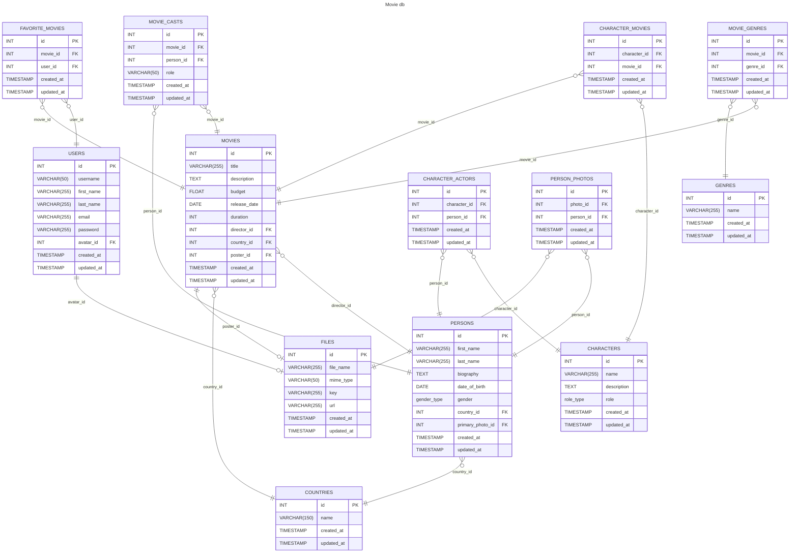

```mermaid
---
title: Movie db
---

erDiagram

    USERS {
        INT id PK
        VARCHAR(50) username
        VARCHAR(255) first_name
        VARCHAR(255) last_name
        VARCHAR(255) email
        VARCHAR(255) password
        INT avatar_id FK
        TIMESTAMP created_at
        TIMESTAMP updated_at
    }

    FILES {
        INT id PK
        VARCHAR(255) file_name
        VARCHAR(50) mime_type
        VARCHAR(255) key
        VARCHAR(255) url
        TIMESTAMP created_at
        TIMESTAMP updated_at
    }

    MOVIES {
        INT id PK
        VARCHAR(255) title
        TEXT description
        FLOAT budget
        DATE release_date
        INT duration
        INT director_id FK
        INT country_id FK
        INT poster_id FK
        TIMESTAMP created_at
        TIMESTAMP updated_at
    }

    GENRES {
        INT id PK
        VARCHAR(255) name
        TIMESTAMP created_at
        TIMESTAMP updated_at
    }

    MOVIE_GENRES {
        INT id PK
        INT movie_id FK
        INT genre_id FK
        TIMESTAMP created_at
        TIMESTAMP updated_at
    }

    CHARACTERS {
        INT id PK
        VARCHAR(255) name
        TEXT description
        role_type role
        TIMESTAMP created_at
        TIMESTAMP updated_at
    }

    CHARACTER_ACTORS {
        INT id PK
        INT character_id FK
        INT person_id FK
        TIMESTAMP created_at
        TIMESTAMP updated_at
    }

    CHARACTER_MOVIES {
        INT id PK
        INT character_id FK
        INT movie_id FK
        TIMESTAMP created_at
        TIMESTAMP updated_at
    }

    MOVIE_CASTS {
        INT id PK
        INT movie_id FK
        INT person_id FK
        VARCHAR(50) role
        TIMESTAMP created_at
        TIMESTAMP updated_at
    }

    PERSONS {
        INT id PK
        VARCHAR(255) first_name
        VARCHAR(255) last_name
        TEXT biography
        DATE date_of_birth
        gender_type gender
        INT country_id FK
        INT primary_photo_id FK
        TIMESTAMP created_at
        TIMESTAMP updated_at
    }

    PERSON_PHOTOS {
        INT id PK
        INT photo_id FK
        INT person_id FK
        TIMESTAMP created_at
        TIMESTAMP updated_at
    }

    COUNTRIES {
        INT id PK
        VARCHAR(150) name
        TIMESTAMP created_at
        TIMESTAMP updated_at
    }

    FAVORITE_MOVIES {
        INT id PK
        INT movie_id FK
        INT user_id FK
        TIMESTAMP created_at
        TIMESTAMP updated_at
    }

    USERS ||--o| FILES : "avatar_id"
    MOVIES }o--|| PERSONS : "director_id"
    MOVIES }o--|| COUNTRIES : "country_id"
    MOVIES ||--o| FILES : "poster_id"

    MOVIE_GENRES }o--|| MOVIES : "movie_id"
    MOVIE_GENRES }o--|| GENRES : "genre_id"

    CHARACTER_ACTORS }o--|| CHARACTERS : "character_id"
    CHARACTER_ACTORS }o--|| PERSONS: "person_id"

    CHARACTER_MOVIES }o--|| CHARACTERS : "character_id"
    CHARACTER_MOVIES }o--|| MOVIES : "movie_id"

    MOVIE_CASTS }o--|| MOVIES : "movie_id"
    MOVIE_CASTS }o--|| PERSONS: "person_id"

    PERSONS }o--|| COUNTRIES : "country_id"

    PERSON_PHOTOS }o--|| PERSONS : "person_id"
    PERSON_PHOTOS }o--|| FILES : "photo_id"

    FAVORITE_MOVIES }o--|| USERS : "user_id"
    FAVORITE_MOVIES }o--|| MOVIES : "movie_id"

```
